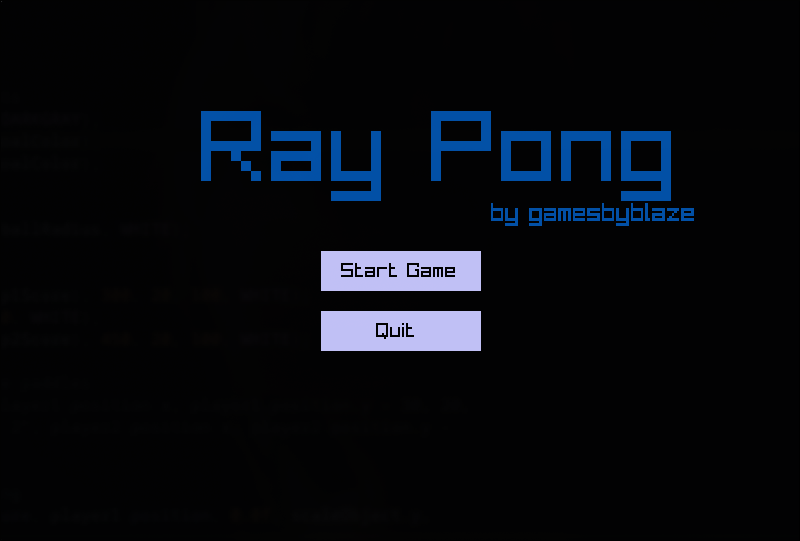
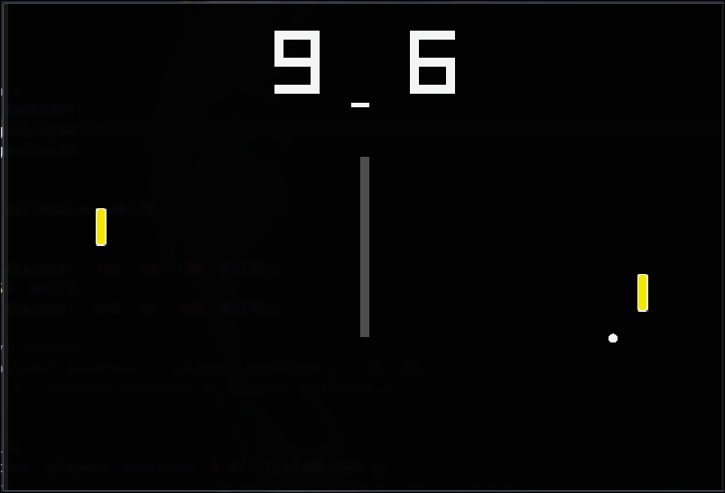

# Pong clone made with Raylib & C

Build with make since cmake hates me ig

```bash
    make linux #to build for linux
    cd builds && ./main #to run execuble

    make windows #to build for windows
    cd builds && ./wmain.exe to run executable
```
### SCREENSHOTS




---
# How to play
Player one:
    W - up
    S - down 

Player two:
    Up - umm up?
    Down - down...

Mouse to navigate main menu,
P to pause gameplay,
Q to quit to main menu from pause menu and to quit game from main menu.

---

# I forgot to mention 
### I use vcpkg for my libraries, can adjust the path for your own library directory in the make file
***Somehow cmake doesn't work so i stuck to make, if you can fix pls contribute.***

---

I used static linking so idk do whatever you want
This simple game took me like 2 weeks to 'complete' but I abandoned it  
The music is a preset from LMMS, hit sfx is a random intrument from LMMS library.
Will work on something else, maybe with GODOT engine

---

PS. I'm just starting out with writing markdowns!
Also, terrible code i know
